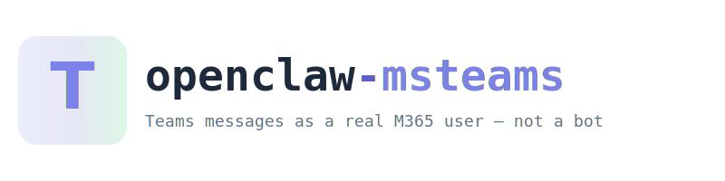

<p align="center">
  <picture>
    <source media="(prefers-color-scheme: dark)" srcset="assets/logo.svg">
    <source media="(prefers-color-scheme: light)" srcset="assets/logo.svg">
    
  </picture>
</p>

Microsoft Teams channel plugin for [OpenClaw](https://openclaw.ai) that sends and receives messages **as a real M365 user account** — not a bot.

**User identity** | **Delegated auth** | **Graph API** | **Webhook subscriptions** | **Open source**


---

## Features

- **Real user identity** — Messages appear as your M365 user, not a bot
- **Delegated auth** — Device-code flow with persistent token cache (~90 day refresh)
- **Inbound webhooks** — Receives Teams notifications via Graph API subscriptions
- **Auto-renewal** — Subscriptions auto-renew every 50 minutes (60-min expiry)
- **Session routing** — `person:<email>` for 1:1 chats, `group:<chatId>` for groups
- **DM policies** — Supports `open`, `allowlist`, and `pairing` modes
- **Markdown chunking** — Long messages split at 4000-char boundaries

## Quick Start

### Install

```bash
openclaw plugins install @knowall-ai/openclaw-msteams
```

### Configure

Add to your `openclaw.json`:

```json
{
  "channels": {
    "msteams-user": {
      "enabled": true,
      "clientId": "your-azure-app-client-id",
      "tenantId": "your-azure-tenant-id",
      "userId": "user-object-id",
      "webhook": {
        "port": 3978,
        "url": "https://your-public-domain.com",
        "clientState": "your-shared-secret"
      },
      "dmPolicy": "allowlist",
      "allowFrom": ["colleague@example.com"]
    }
  }
}
```

### Authenticate

```bash
openclaw channels login msteams-user
```

Visit the URL shown, enter the code, sign in with the M365 account. Done — tokens auto-renew for ~90 days.

### Verify

```bash
openclaw channels status msteams-user
# Microsoft Teams (User) default: enabled, configured, running, works
```

## How It Works

```
MS Graph Webhooks ──▶ Plugin Monitor (:3978) ──▶ OpenClaw Gateway
                          │                           │
                          │ validates clientState      │ processes message
                          │ enriches sender info       │ routes to session
                          │ fetches conversation       │
                          ▼                           ▼
                     /hooks/wake              Agent replies via
                                              Graph API outbound
                                                    │
                                                    ▼
                                              Teams Chat
                                         (as real M365 user)
```

## Prerequisites

| Requirement | Details |
|-------------|---------|
| OpenClaw | Running instance |
| Node.js | 18+ |
| Azure AD App | With delegated Graph API permissions |
| Public HTTPS | For Graph webhook notifications |

### Required Azure AD Permissions (Delegated)

- `Chat.ReadWrite` — Read and send chat messages
- `ChatMessage.Send` — Send messages in chats
- `ChannelMessage.Send` — Send messages in channels
- `User.Read` — Read authenticated user profile
- `Chat.Read` — Read chat metadata
- `User.ReadBasic.All` — Read basic profile of other users

## Project Structure

```
├── index.ts                 # Plugin entry point
├── openclaw.plugin.json     # Plugin manifest
├── package.json             # Package config
├── src/
│   ├── auth.ts              # MSAL delegated auth (device-code flow)
│   ├── channel.ts           # ChannelPlugin definition (all adapters)
│   ├── inbound.ts           # Notification processing + session routing
│   ├── monitor.ts           # Express webhook server
│   ├── outbound.ts          # ChannelOutboundAdapter
│   ├── runtime.ts           # Plugin runtime getter/setter
│   ├── send.ts              # Graph API message sending
│   ├── subscriptions.ts     # Graph webhook subscription lifecycle
│   ├── token.ts             # Credential resolution from config
│   └── types.ts             # Shared TypeScript types
└── docs/
    ├── SOLUTION_DESIGN.adoc # Architecture and design
    ├── DEPLOYMENT.adoc      # Installation and configuration
    ├── TESTING.adoc         # Testing guide
    ├── TROUBLESHOOTING.adoc # Common issues and fixes
    ├── generate-docs.sh     # PDF generator script
    └── themes/
        └── knowall-theme.yml # PDF theme
```

## Documentation

| Document | Description |
|----------|-------------|
| [Solution Design](docs/SOLUTION_DESIGN.adoc) | Architecture, data flow, design decisions |
| [Deployment](docs/DEPLOYMENT.adoc) | Installation, configuration, reverse proxy |
| [Testing](docs/TESTING.adoc) | Manual testing checklist, verification |
| [Troubleshooting](docs/TROUBLESHOOTING.adoc) | Common issues and their fixes |

## vs. Official `@openclaw/msteams`

| | This Plugin | Official Plugin |
|--|-------------|-----------------|
| **Identity** | Real M365 user | Bot identity |
| **Auth** | Delegated (device-code) | Bot Framework (app credentials) |
| **API** | Microsoft Graph | Bot Framework SDK |
| **Messages** | Appear as the user | Appear as a bot |
| **Setup** | Azure AD app + login | Bot registration + channels |

## Development

```bash
git clone https://github.com/knowall-ai/openclaw-msteams.git
cd openclaw-msteams
npm install
openclaw plugins install --link ./index.ts
```

## License

MIT

---

Built by [KnowAll AI](https://knowall.ai)
